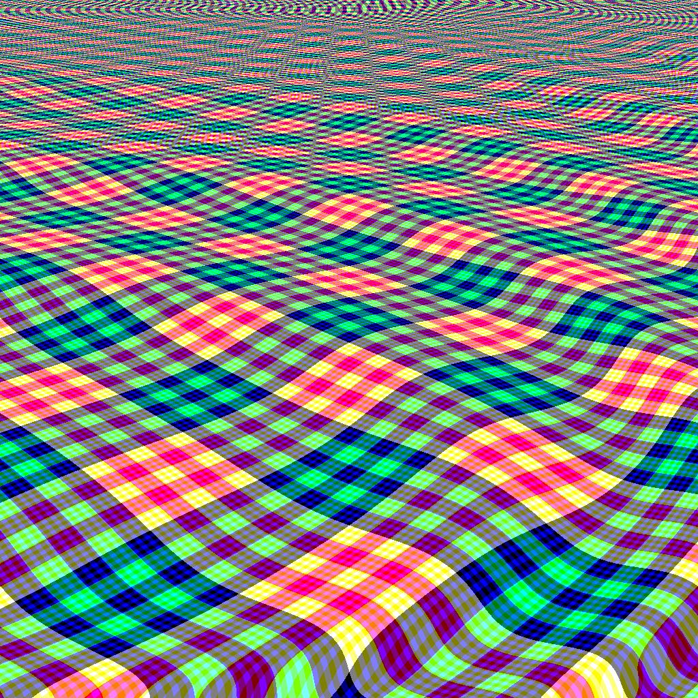

## tweetable-mathematical-art

这个 tweetable-mathematical-art 是 Kyle McCormick 在 StackExchange 上发起了一个叫做 [Tweetable Mathematical Art](http://codegolf.stackexchange.com/questions/35569/tweetable-mathematical-art) 。原文中是使用C++编写。 这个 repository 使用 JavaScript 代码实现来方便运行。后续会继续更新更多的效果。

### screenshot

### Example

[tweetable-mathematical-art](https://maohhgg.github.io/tweetable-mathematical-art)
